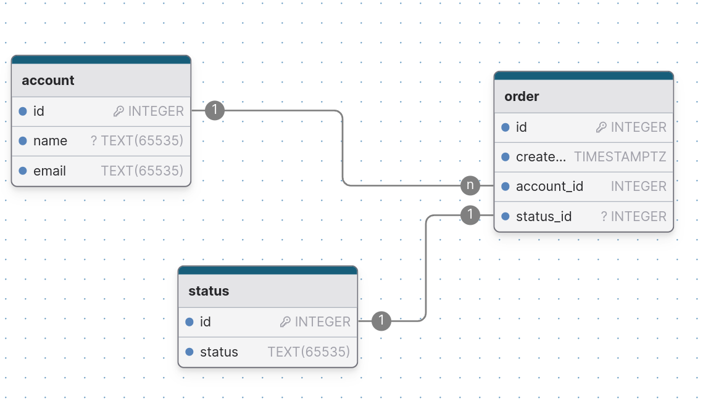

# Order Status Tracker BackEnd

Backend for tracking order build using express.js

### Install dependencies

This project uses `pnpm`

```bash
pnpm install
```

### Update you `.env`

Update your .env file with the required config values

## Start server

This assumes that you have Postgres installed and running locally on your machine.

The database schema consists of three tables, `account` storing user details, `orders` storing orders made and a `status` relations showing the status of an order.



## Run prisma migrations

```bash
pnpm exec prisma migrate dev
```

## seed database

```bash
pnpm seed
```

## start dev server

```bash
pnpm local:watch
```
